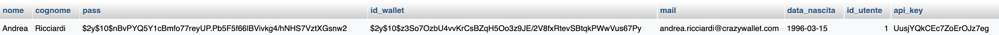
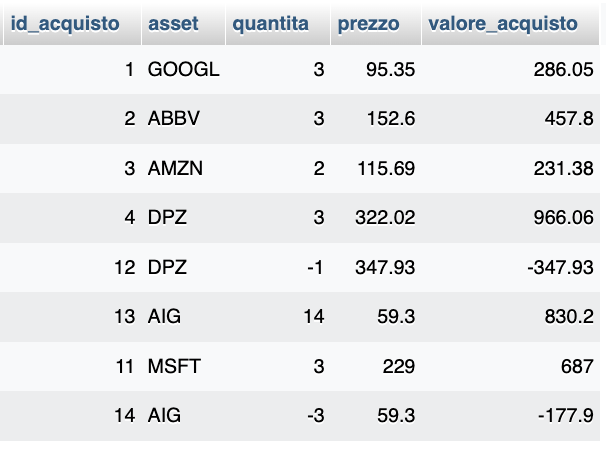
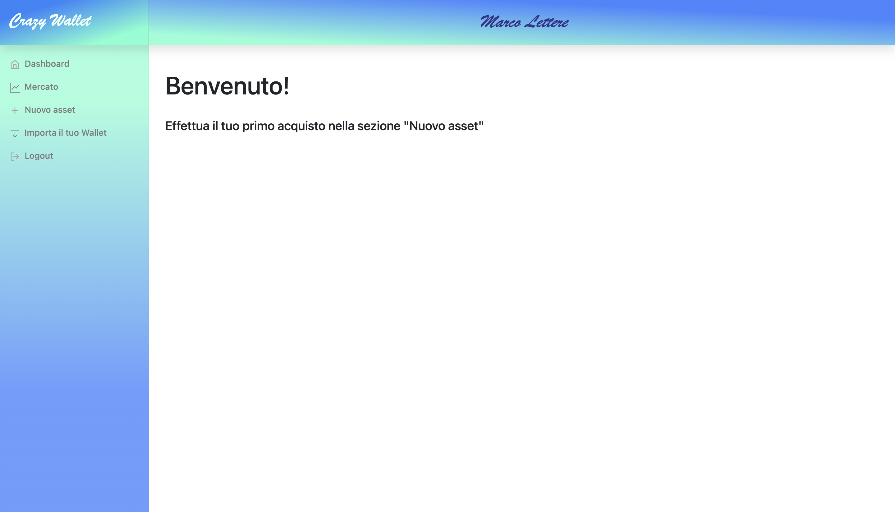
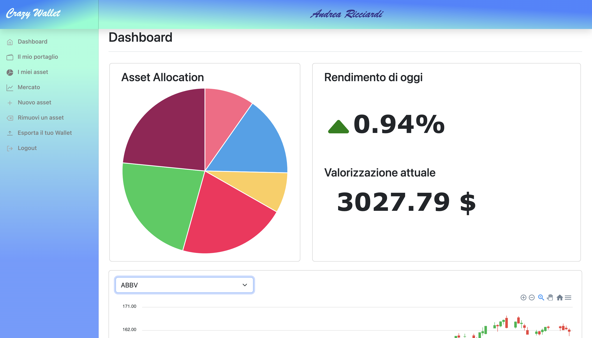
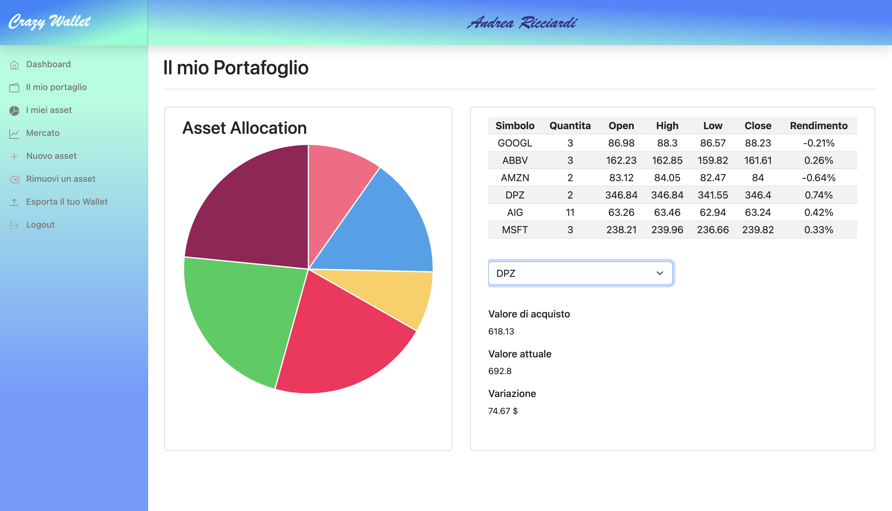
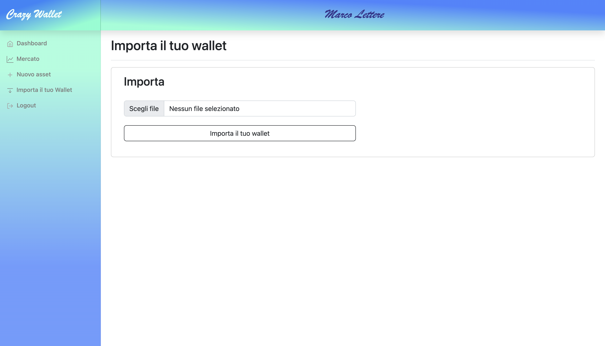
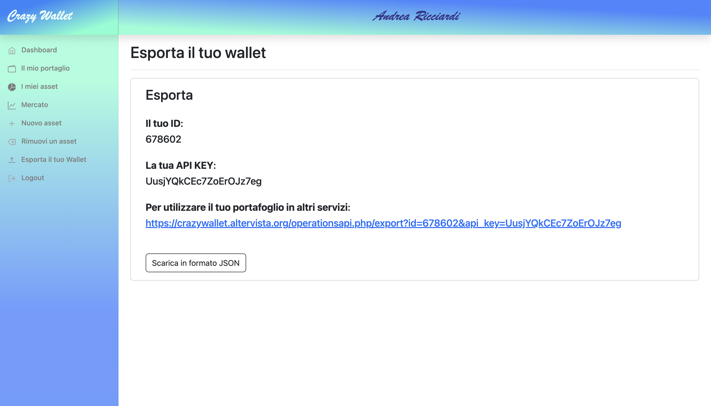

<h2>Crazy Wallet</h2>

La web app Crazy Wallet è uno strumento finanziario utile a tenere traccia dell'andamento delle principali aziende quotate in borsa, per la precisione quelle contenute nell'indice <b>Standard & Poors 500</b>.
Viene anche fornita la possibilità di costruire un proprio portafoglio, per poter tenere traccia rapidamente degli asset di interesse.

<h3>Realizzazione</h3>

Crazy Wallet è stata realizzata appongiandosi sull'infrastruttura gratuita Altervista, la quale mette a disposizione un web server raggiungibile da remoto e un database MySql per poter tener traccia dei dati. Grazie alle API di AlphaVantage è stato possibile avere a disposizione, in maniera rapida e dinamica, le quotazioni storiche e attuali del mercato. I layout di pagina sono stati realizzati a partire dagli elementi messi a disposizione dalla libreria Bootstrap, i grafici a candela da ApexCharts ed infine i grafici a torta da Chart.js. La parte Server è stata realizzata interamente in PHP. 

<h3>Client-Side </h3>

Come detto, si è partiti dagli esempi messi a disposzione da Bootstrap, in maniera da avere un layout gradvole e responsive. Il foglio di stile è stato modificato per far si che ogni pagina dell'applicazione fosse maggiormente fruibile anche nei dispositivi mobili.
 
Gran parte degli effetti visivi e del plot dei grafici è stata realizzata mediante Javascript, in particolare utilizzando la sintassi JQuery. L'utilizzo preponderante è stato fatto per permettere l'aggiornamento dei grafici in base alle richieste dell'utente (principalmente nelle sezioni <b>Stock Market</b> e <b>My Assets</b>) e per mostrare i valori di eventuale acquisto o vendita in tempo reale (nelle pagine <b>Acquista</b> e <b>Vendi</b>). Ciò è stato possibile sfruttando la metodologia AJAX, in maniera da interpellare le API di AlphaVantage nel momento in cui si modificava un parametro. Questo aspetto verrà spiegato nel dettaglio nelle sezioni a seguire.

<h3>Server-Side</h3>

Le operazioni realizzate dal server sono principalmente quelle di Login e Logout, richieste all'API di AlphaVantage (e la successiva lavorazione di essi in base alla funzione richiesta) e le operazioni CRUD sul database. Si è deciso di lasciare il compito di trattare i dati delle API al server per poter permettere la fruizione dell'applicazione anche ai dispositivi meno prestanti. 

<h3>Database</h3>

L'app si appoggia su un DB di tipo MySQL. Non vi è una vera e propria struttura, in quanto è presente solamente una tabella Utenti e successivamente viene creata una tabella per ogni wallet, con lo storico delle transazioni.
&nbsp;
<figure>

<figcaption>Esempio di una entry nella tabella Utenti</figcaption>
</figure>
&nbsp;
<figure>

<figcaption>Esempio di un Wallet</figcaption>
</figure>

 

<h3>API</h3>

Nell'app, come anticipato, sono state utilizzati API per le interazioni con il database. Esiste però un altro tipo di API, che permettono di importare o esportare il proprio wallet in maniera da poterlo utilizzare in altre applicazioni nell'ambito finanziario. Esiste la possibilità di scaricare un file JSON (nella sezione <b>Esporta il tuo wallet</b>) o di accedervi direttamente tramite chiamata HTML col metodo GET. Ad ogni utente verrà assegnata una key al momento dell'iscrizione e gli sarà mostrato un id diverso da quello utilizzato nel Database. In questa maniera sarà sufficiente "comporre" la richiesta HTML con i propri dati.

<h3>Registrazione e login</h3>

Le principali funzioni di Crazy Wallet sono riservate agli utenti registrati. Per poterlo fare è necessario aver compiuto 18 anni. Viene anche richiesto un codice per il proprio Wallet, da conservare in quanto necessario per compiere ogni transazione. L'unica funzione a disposizione dell'utente ospite è ila visualizzazione dell'andamento del mercato.

<h3>Dashboard e Il Mio Portafoglio</h3>

Dopo il login si verrà reinderizzati alla dashboard, con un messaggio di benvenuto.
&nbsp;
<figure>

<figcaption>Schermata iniziale</figcaption>
</figure>

Dopo l'inserimento nel portafoglio del primo asset (o l'importazione di un portafoglio dall'apposita sezione), la dashboard si aggiornerà: mostrerà un grafico a torta con la suddivisone degli asset nel proprio portafoglio e l'andamento (ovvero se si è in guadagno o in perdita). Nella versione PC vi è presente anche un grafico con l'andamento giornaliero dei propri asset.
&nbsp;
<figure>

<figcaption>Dashboard</figcaption>
</figure>
Ne Il Mio Portafoglio è invece presente una visione più dettagliata del portafoglio, una tabella che mostra il rendimento per singolo asset e un menù a tendina che mostra la variazione dell'asset selezionato.
&nbsp;
<figure>

<figcaption>Il mio portafoglio</figcaption>
</figure>

<h3>I Miei Asset e Mercato</h3>

In queste due sezioni vengono mostrati il grafico e una tabella in base all'asset e al timestamp selezionato. Tramite la metodologia AJAX, è possibile cambiare sia Asset di riferimento che timestamp e avere il nuovo risultato in tempo reale. La differenza sostanziale la fra le due pagine è che nella prima si possono selezionare gli asset presenti nel portafoglio, mentre nella seconda va digitato il symbol dell'asset desiderato.

&nbsp;
<figure>

<figcaption>I tuoi asset</figcaption>
</figure>
&nbsp;
<figure>

<figcaption>Mercato</figcaption>
</figure>

<h3>Nuovo Asset e Rimuovi un Asset</h3>

Queste due sezioni sono analoghe, nel senso che la rimozione di un asset è stata realizzata come un acquisto in quantità negativa. L'utente può visualizzare il valore attuale dell'asset che vuole acquistare e il valore totale in base alla quantità che vuole inserire o rimuovere. Per realizzare l'operazione, sarà necessario inserire il codice del proprio wallet deciso in fase di registrazione.

&nbsp;
<figure>

<figcaption>Nuovo asset</figcaption>
</figure>

<h3>Importa ed Esporta il tuo Wallet</h3>

Come anticipato, se il prorpio wallet non contriene alcun asset, è possibile importarne uno da un file in formato JSON.
&nbsp;
<figure>

<figcaption>Importa</figcaption>
</figure>
Infine, è possibile sia scaricare il proprio wallet in formato JSON o, tramite la propria API key e il proprio ID renderlo disponibile all'utilizzo per applicazioni esterne.
&nbsp;
<figure>

<figcaption>Esporta</figcaption>
</figure>
In entrambi i casi, il contenuto sarà composto dagli asset e dalle quantità posseduta di ognuno di essi.

